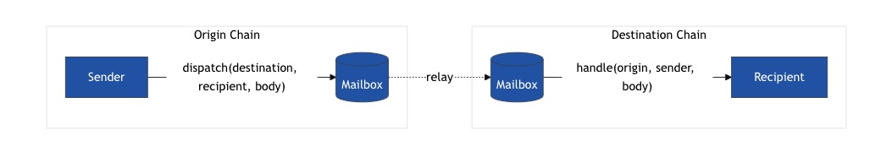

## Open Intents Framework

The Open Intents Framework is an open-source framework that provides a full stack of smart contracts, solvers and UI with modular abstractions for settlement to build and deploy intent protocols across EVM chains.

With out-of-the-box ERC-7683 support, the Open Intents Framework standardizes cross-chain transactions and unlocks intents on day 1 for builders in the whole Ethereum ecosystem (and beyond).

https://github.com/BootNodeDev/intents-framework
https://github.com/hyperlane-xyz/hyperlane-monorepo

## ERC-7683: Cross Chain Intents

The following standard allows for the implementation of a standard API for cross-chain value-transfer systems. This standard provides generic order structs, as well as a standard set of settlement smart contract interfaces.

https://eips.ethereum.org/EIPS/eip-7683

## Hyperlane

Hyperlane is a permissionless interoperability protocol for cross-chain communication. It enables message passing and asset transfers across different chains without relying on centralized intermediaries or requiring any permissions.

### Protocol Overview
https://docs.hyperlane.xyz/docs/protocol/protocol-overview

### Mailbox
https://docs.hyperlane.xyz/docs/protocol/mailbox

### How to Connect Your Chain with Hyperlane
https://docs.hyperlane.xyz/docs/deploy-hyperlane

### How to Bridge a Token with Hyperlane Warp Routes
https://docs.hyperlane.xyz/docs/guides/deploy-warp-route
